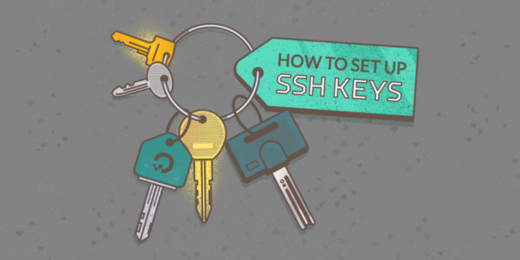

# SSH szerver

## Bevezetés

Az SSH (Secure Shell) egy titkosított protokoll, amely távoli számítógépekhez való biztonságos kapcsolódást tesz lehetővé. Használható fájlok másolására, parancsok futtatására és távoli gépek konfigurálására.

Ez a markdown jegyzet az SSH telepítésének lépéseit mutatja be Windows, macOS és Linux rendszereken.

### SSH telepítése Ubuntu Linux rendszeren

Az SSH szerver alapértelmezés szerint nincs telepítve minden Ubuntu rendszerre, de a telepítése nagyon egyszerű. Az alábbi lépéseket követve telepítheti az SSH-t az Ubuntu rendszerére:

### Csomagok frissítése

A legfrissebb csomaglista letöltéséhez írja be a következő parancsot a terminálba, majd nyomja meg az Enter billentyűt:

```bash
sudo apt update && apt upgrade -y
```

### SSH telepítése

Írja be a következő parancsot a terminálba az SSH szerver telepítéséhez, majd nyomja meg az Enter billentyűt:

```bash
sudo apt install openssh-server
```

### Telepítés ellenőrzése

- Annak ellenőrzéséhez, hogy az SSH szolgáltatás fut-e, írja be a következő parancsot a terminálba:

```bash
sudo service ssh status
```

Ha a szolgáltatás fut, akkor a kimenet hasonló lesz a következőhöz:

```bash
● sshd.service - OpenSSH SSH server
     Active: active (running) since máj  7 00:12:17 2024; 1 min 18s ago
    Process: 1234 (ssh)
   PID: /usr/sbin/sshd -D (ssh)
    CGroup: /system/fs/cgroup/systemd/system/sshd.service
   Control: /usr/lib/systemd/system/sshd.service
           CGroup: /system/fs/cgroup/systemd/system/sshd.service
           State: running

 máj  7 00:12:17 systemd[1]: Starting OpenSSH SSH server...
 máj  7 00:12:17 sshd[1234]: Server listening on 0.0.0.0 port 22.
 máj  7 00:12:17 systemd[1]: Started OpenSSH SSH server.
```

### tűzfal beállítása (opcionális)

Ha tűzfalat használ az Ubuntu rendszerén, engedélyeznie kell a bejövő SSH-kapcsolatokat. Az UFW tűzfal esetén a következő parancsot használhatja:

```bash
sudo ufw allow OpenSSH
```

Gratulálunk! Sikeresen telepítette az SSH szervert az Ubuntu rendszerére. Most már távolról csatlakozhat a számítógépéhez egy másik számítógépről SSH-ügyfél segítségével.

### SSH csatlakozás

Csatlakozáshoz szükséges szintaxis:

```bash
ssh [felhasználónév]@[távoli számítógép hosztneve vagy IP-címe]
```

### SSH kulcspár készítése [DigitalOcean tutorial](https://www.digitalocean.com/community/tutorials/how-to-set-up-ssh-keys-on-ubuntu-20-04)



The first step is to create a key pair on the client machine (usually your computer):

```shell
ssh-keygen -b 4096
```

Ha szerveren hozod létre a kulcsot, akkor a privát kulcsot kell bemásolni az authorized keys-be

```bash
cat id_rsa.pub >> authorized_keys
```

### SSH konfig fájl

`sudo nano /etc/ssh/sshd_config` módosítandó sorok:

```conf
Port 22
PasswordAuthentication no
PermitRootLogin no

# 2x 10 perc inaktivitás után megszakad a munkamenet
ClientAliveInterval 600
ClientAliveCountMax 2
```

### config fájl újratöltése

```bash
sudo systemctl reload sshd
```

### SSH szolgáltatás újraindítása

```bash
sudo systemctl restart ssh
```
